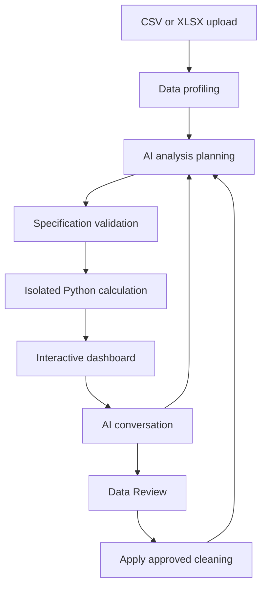

# AI Data Analysis Agent

**From raw data to a clearer picture.**

An intelligent workspace that turns CSV and Excel files into interactive dashboards, grounded insights, and a conversation with your data.

---

## Overview

AI Data Analysis Agent helps people explore a dataset without starting from a blank notebook or building a dashboard manually. Upload a file, let the agent examine its structure and propose a suitable analysis, then explore the resulting metrics and visualizations.

The dashboard adapts to the uploaded data. A retail dataset can reveal sales trends and market performance; a different dataset can produce a different set of metrics and charts based on its available columns.

The project combines language models for analysis planning and explanations, Python for calculations, and a browser-based dashboard for interactive exploration.

## What you can do

| Feature | Experience |
| --- | --- |
| **Automatic exploration** | Upload CSV or XLSX and let the agent identify useful metrics, dimensions, and visualizations. |
| **Adaptive dashboards** | Explore KPI cards, bar, horizontal bar, line, area, pie, donut, treemap, histogram, scatter and box plots selected for your dataset. |
| **Chart controls** | AI defaults appear first. Switch among data-compatible plots, including alternative views of scatter, histogram and box plots; category controls adapt to the selected view. Stable category colors remain consistent across charts and filters. |
| **Instant filtering** | Change supported filters after the dashboard is prepared; cached aggregates update the view locally. |
| **AI conversation** | Ask about findings, request another analysis, or change how a chart is presented. |
| **Data profiling** | Inspect columns, missing values, and identical rows through Data Details. |
| **Data Review** | Preview rows requested through the AI assistant, including exact duplicates. |
| **Controlled cleaning** | Review proposed duplicate removal and apply it when you are ready to update the dashboard. |
| **Report exports** | Download JSON analysis results, CSV data with applied cleaning, or a single-page 16:9 PDF matching the dashboard canvas. |
| **Two languages** | Use English or Indonesian for the interface and analysis explanations. |

## From upload to insight

1. **Upload your dataset.** Select a CSV or XLSX file, up to 40 MB.
2. **Understand its structure.** The workspace profiles the columns, completeness, and duplicate rows.
3. **Let the agent plan.** AI proposes metrics and charts using the available columns. When a definition needs clarification, it asks a question.
4. **Calculate the results.** A validated dashboard specification runs through trusted Python code in an isolated sandbox.
5. **Explore the dashboard.** Review KPIs, visualizations, and an analysis brief; change supported filters without rerunning the AI.
6. **Continue the analysis.** Use the AI assistant to add a chart, explain a result, or inspect data before applying a change.

## The agent architecture

### Planning

Language models interpret the dataset summary and the user's request to propose an analysis. Plans use the supplied column names and pass through structural validation before execution.

### Calculation

Python, Pandas, and NumPy calculate the dashboard's aggregates inside an isolated E2B sandbox. The computation uses trusted application code driven by the validated specification.

### Explanation

AI writes explanations using verified facts from the calculated results and active selection. The chat can also request a new dashboard configuration or a supported visualization change.

### Interaction

The browser keeps prepared dashboard aggregates so supported filters respond quickly. Data Review provides a separate place to inspect proposed cleaning before committing it.

This is an application built around existing language models accessed through APIs. Its development focuses on agent orchestration, validation, analytical computation, and the user experience.

## Data Review and duplicate handling

Two rows are considered identical only when their values match across **all columns**. Timestamp differences are preserved: records at `08:26` and `08:27` are distinct.

Inspecting duplicates leaves the working dataset unchanged. **Apply Changes** keeps one copy of each exact duplicate within the reviewed scope and updates the dashboard after the user approves the change.

CSV exports reflect the working dataset and cleaning that has actually been applied.

All KPI cards and charts fit inside one fixed 16:9 presentation canvas. The layout scales as visuals are added, including on small screens. PDF export captures the current chart types, formatting and positions on one landscape page.

## Example requests

> Add a monthly Quantity chart to the dashboard. Keep the existing charts.

> Change the country comparison to a horizontal bar chart.

> Show rows that are identical across every column in Data Review. Keep the complete InvoiceDate timestamp. Do not delete them yet.

> Explain the main findings for the active filters in Indonesian.

Available actions depend on the columns, results, and visualization types supported by the application. Histograms use fixed numeric bins; scatter plots preserve paired observations; box plots show quartiles with minimum/maximum whiskers. Scatter and box plots sample up to 1,000 rows per filter partition when necessary, with an explicit notice; KPI calculations continue to use all rows.

## Technology

| Layer | Technology |
| --- | --- |
| Web application | Next.js, React, TypeScript |
| Interface | Tailwind CSS, Radix UI |
| Visualization | Recharts |
| File processing | SheetJS, browser Web Workers |
| Analytical computation | Python, Pandas, NumPy |
| Isolated execution | E2B Code Interpreter |
| AI integration | Google model API and an OpenAI-compatible API |
| PDF reporting | jsPDF |

## Analytical scope

Metrics depend on the dataset's structure and the definitions selected for the analysis. Missing values, returns, and cancellations can affect how a metric should be interpreted. The workspace preserves these distinctions through the analysis plan and its definitions.

AI explanations help interpret calculated results; they do not establish causation or replace validation of business definitions.

---

**Upload. Explore. Ask. Understand.**

AI Data Analysis Agent · An interactive workspace for data analysis

## Model verification

The Settings dropdown shows account-accessible Relink models that passed the deployed agent checks. The full provider catalog remains discoverable through `/api/models?catalog=all`; catalog availability alone does not establish agent compatibility. On 2026-10-07, 15 of 17 account catalog models passed plan generation, isolated Python calculation and grounded insight checks with a four-row synthetic fixture. `glm-5.3-flash` and `glm-5.3-flash-mod` timed out and are excluded from Settings. This is a functional snapshot, not a reliability guarantee or a test of every provider-advertised model. See `scripts/active-model-results.json` for per-stage results.

Scatter coordinates remain in the browser dashboard and are excluded from model context. Box plots show quartiles and minimum/maximum whiskers; large raw-data charts disclose deterministic sampling. Histogram charts retain all requested bins, including empty bins.

### Dashboard canvas and data preparation

AI chooses charts and their initial positions on a single dashboard canvas. Arrange layout enables dragging, keyboard movement, resizing and grid alignment. Adding a chart retains existing chart definitions and visual settings; positions and sizes are rearranged to accommodate new charts in the same canvas. Default is a separate chart-type choice, and the original chart type remains in the list. Visual formatting includes titles, legends, labels, axes and colorful, pastel or single-color palettes. Charts grouped by the dashboard's active categorical filter can filter linked visuals when a category is clicked.

Upload prepares unambiguous numeric values and surrounding whitespace while preserving identifiers, leading-zero codes and ambiguous dates. Original data remains downloadable. AI Requested Data lists exact duplicates, missing values and IQR outlier flags, affected-row previews and expected row counts. Removal and numeric mean/median imputation are staged for review, and affect the dashboard only after Apply changes. Outlier flags are not evidence of invalid records. Exact KPI impacts are computed after application.
