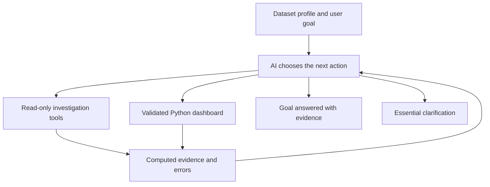

# AI Data Analysis Agent

**From raw data to clear insights.**

An intelligent workspace that turns CSV and Excel files into interactive dashboards, grounded insights, and a conversation with your data.

---

## Overview

AI Data Analysis Agent helps people explore a dataset without starting from a blank notebook or building a dashboard manually. Upload a file, let the agent investigate the data, evaluate evidence and build a suitable analysis, then explore the resulting metrics and visualizations.

The dashboard adapts to the uploaded data. A retail dataset can reveal sales trends and market performance; a different dataset can produce a different set of metrics and charts based on its available columns.

The project combines language models for iterative analytical decisions and explanations, Python for calculations, and a browser-based dashboard for interactive exploration.

## What you can do

| Feature | Experience |
| --- | --- |
| **Automatic exploration** | Upload CSV or XLSX and let the agent identify useful metrics, dimensions, and visualizations. |
| **Adaptive dashboards** | Explore KPI cards, bar, horizontal bar, line, area, pie, donut, treemap, histogram, scatter and box plots selected for your dataset. |
| **Chart controls** | AI defaults appear first. Switch among data-compatible plots, including alternative views of scatter, histogram and box plots; category controls adapt to the selected view. Stable category colors remain consistent across charts and filters. |
| **Instant filtering** | Change supported filters after the dashboard is prepared; cached aggregates update the view locally. |
| **AI conversation** | Ask about findings, request another analysis, or change how a chart is presented. |
| **Data profiling** | Inspect columns, missing values, and identical rows through Data Details. |
| **Data Review** | Preview rows requested through the AI assistant, including exact duplicates. |
| **Controlled cleaning** | Review proposed duplicate removal and apply it when you are ready to update the dashboard. |
| **Report exports** | Download a self-contained HTML dashboard with offline filters, tooltips and zoom, a single-page 16:9 PDF matching the canvas, cleaned CSV, or JSON analysis results. |
| **Session recovery** | Refresh the same tab to restore data, dashboard, filters, chat and visual settings. Agent decisions and tool reports are checkpointed; interrupted investigations can be continued. A new tab starts a fresh session. Completed dashboards remain usable offline after the workspace has been cached. |
| **Two languages** | Use English or Indonesian for the interface and analysis explanations. |

## From upload to insight

1. **Upload your dataset.** Select a CSV or XLSX file, up to 40 MB.
2. **Understand its structure.** The workspace profiles the columns, completeness, and duplicate rows.
3. **Let the agent investigate.** AI chooses quality checks, descriptive statistics, grouped aggregations, distributions, correlations or custom Python investigations, reads their results and chooses the next action. It asks only when an essential requested business definition is missing.
4. **Calculate the results.** A validated dashboard specification runs through trusted Python code in an isolated sandbox.
5. **Evaluate the evidence.** The agent inspects the computed dashboard and can investigate further or revise it before declaring the goal answered. Explore KPIs, visualizations and a grounded analysis brief.
6. **Continue the analysis.** Use the AI assistant to add a chart, explain a result, or inspect data before applying a change.

## The agent architecture

### Planning

Language models choose a next action from the profile, user goal, prior tool results and execution errors. Decisions are validated against existing columns and allowed read-only tools. The loop continues after a dashboard is computed; completion requires references to successful investigation evidence and the latest dashboard result. Investigation evidence is retained in the saved session and JSON report.

### Recovery and execution budgets

Every decision is saved before execution and every result is saved afterwards, separately from the dashboard session. Refreshing the same tab retains the investigations and provides Continue analysis. A run is scoped to its dataset and filter selection. Approved source changes invalidate old evidence. An eight-minute active-run timeout or 24-action budget pauses the work as incomplete; continuation preserves evidence and starts a new execution allowance. Closing the tab does not run a background agent. Model outages also retain the checkpoint instead of marking the goal complete.

### Calculation

Python, Pandas, and NumPy calculate the dashboard's aggregates inside an isolated E2B sandbox. The computation uses trusted application code driven by the validated specification. Built-in read-only EDA tools run in the dataset worker; custom AI-written Python runs in a separate disposable E2B sandbox; source edits remain staged until Apply changes. Pearson correlation is descriptive, not evidence of causation. IQR candidates are not automatically deleted.

### Explanation

AI writes explanations using verified facts from the calculated results and active selection. The chat can also request a new dashboard configuration or a supported visualization change.

### Interaction

The browser keeps prepared dashboard aggregates so supported filters respond quickly. Data Review provides a separate place to inspect proposed cleaning before committing it.

This is an application built around existing language models accessed through APIs. Its development focuses on agent orchestration, validation, analytical computation, and the user experience.

## Data Review and duplicate handling

Two rows are considered identical only when their values match across **all columns**. Timestamp differences are preserved: records at `08:26` and `08:27` are distinct.

Inspecting duplicates leaves the working dataset unchanged. **Apply Changes** keeps one copy of each exact duplicate within the reviewed scope and updates the dashboard after the user approves the change.

CSV exports reflect the working dataset and cleaning that has actually been applied.

All KPI cards and charts fit inside one fixed 16:9 presentation canvas. The layout scales as visuals are added, including on small screens. PDF export captures the current chart types, formatting and positions on one landscape page.

## Example requests

> Add a monthly Quantity chart to the dashboard. Keep the existing charts.

> Change the country comparison to a horizontal bar chart.

> Show rows that are identical across every column in Data Review. Keep the complete InvoiceDate timestamp. Do not delete them yet.

> Explain the main findings for the active filters in Indonesian.

Available actions depend on the columns, results, and visualization types supported by the application. Histograms use fixed numeric bins; scatter plots preserve paired observations; box plots show quartiles with minimum/maximum whiskers. Scatter and box plots sample up to 1,000 rows per filter partition when necessary, with an explicit notice; KPI calculations continue to use all rows.

## Technology

| Layer | Technology |
| --- | --- |
| Web application | Next.js, React, TypeScript |
| Interface | Tailwind CSS, Radix UI |
| Visualization | Recharts |
| File processing | SheetJS, browser Web Workers |
| Analytical computation | Python, Pandas, NumPy |
| Isolated execution | E2B Code Interpreter |
| AI integration | Google model API and an OpenAI-compatible API |
| PDF reporting | jsPDF |

## Analytical scope

Metrics depend on the dataset's structure and the definitions selected for the analysis. Missing values, returns, and cancellations can affect how a metric should be interpreted. The workspace preserves these distinctions through the analysis plan and its definitions.

AI explanations help interpret calculated results; they do not establish causation or replace validation of business definitions.

---

**Upload. Explore. Ask. Understand.**

AI Data Analysis Agent · An interactive workspace for data analysis

## Model verification

The Settings dropdown shows account-accessible Relink models that passed the deployed agent checks. The full provider catalog remains discoverable through `/api/models?catalog=all`; catalog availability alone does not establish agent compatibility. On 2026-10-07, 15 of 17 account catalog models passed plan generation, isolated Python calculation and grounded insight checks with a four-row synthetic fixture. `glm-5.3-flash` and `glm-5.3-flash-mod` timed out and are excluded from Settings. This is a functional snapshot, not a reliability guarantee or a test of every provider-advertised model. See `scripts/active-model-results.json` for per-stage results.

Scatter coordinates remain in the browser dashboard and are excluded from model context. Box plots show quartiles and minimum/maximum whiskers; large raw-data charts disclose deterministic sampling. Histogram charts retain all requested bins, including empty bins.

### Dashboard canvas and data preparation

AI chooses charts and their initial positions on a single dashboard canvas. Arrange layout enables dragging, keyboard movement, resizing and grid alignment. Adding a chart retains existing chart definitions and visual settings; positions and sizes are rearranged to accommodate new charts in the same canvas. Default is a separate chart-type choice, and the original chart type remains in the list. Visual formatting includes titles, legends, labels, axes and colorful, pastel or single-color palettes. Charts grouped by the dashboard's active categorical filter can filter linked visuals when a category is clicked.

Upload prepares unambiguous numeric values and surrounding whitespace while preserving identifiers, leading-zero codes and ambiguous dates. Original data remains downloadable. AI Requested Data lists exact duplicates, missing values and IQR outlier flags, affected-row previews and expected row counts. Removal and numeric mean/median imputation are staged for review, and affect the dashboard only after Apply changes. Outlier flags are not evidence of invalid records. Exact KPI impacts are computed after application.

Interactive HTML exports contain the dashboard aggregates needed for all supported filter selections. AI chat and new Python analyses remain available in the online application. Session recovery stores working data locally in the browser, scoped to the current tab; it does not upload a backup to a server.

### Custom Python investigations

The agent can choose a `python` tool when built-in investigations are insufficient. It writes Python against a private copy of the active dataset selection, runs it in a disposable E2B sandbox with internet access disabled and a 60-second execution timeout, and receives structured numeric evidence or an error to correct. No provider credentials are injected into the sandbox. Each run is terminated after execution; modifications inside it do not replace the workspace dataset. Source changes still require Apply changes.

Computed custom metrics can ground the final brief. Their statistical methodology remains the model’s responsibility: finite-number validation does not establish that an analysis is appropriate. Dashboard rendering continues through the validated dashboard specification using existing dataset columns; arbitrary Python plots and derived-column dashboards are not yet supported.

### Diverse dataset regression corpus

`node scripts/check-diverse-agent-corpus.mjs --generate --local` generates 60 synthetic CSV/XLSX fixtures across ten domains and edge cases (including 100,000 rows). It independently compares Python-prepared dashboard KPIs and active filters with a separate Pandas calculation. Fixtures contain no private data. `node scripts/check-diverse-agent-corpus.mjs --live` additionally exercises 50 iterative agents through the deployed API, real E2B execution and grounded briefs using existing server-side credentials; it defaults to three concurrent streams (`CORPUS_CONCURRENCY` overrides this) and may consume provider quota. Reruns skip completed passes and resume saved checkpoints; the previous results are retained as a timestamped snapshot. Stop live batches when provider quota or availability errors recur. `CORPUS_MODEL` sets the first model preference. Results are stored under `.tmp/diverse-agent-corpus`, or `CORPUS_DIR`. No secrets are read by the test runner.

`node scripts/check-python-category-codes.mjs` verifies that Python preserves leading-zero category codes and identifiers, literal NA categories, numeric measures and matching active filters.

`node scripts/check-public-dataset-corpus.mjs` downloads and independently checks 20 public Seaborn example datasets (source URLs and SHA-256 hashes are recorded). `--public-live` additionally selects five datasets for real agent/E2B checks. Public fixtures use `.tmp/public-dataset-corpus` or `CORPUS_PUBLIC_DIR`. `node scripts/check-corpus-statistics.mjs` independently audits custom Spearman calculations from completed live checkpoints; set `CORPUS_DIR` to the saved synthetic corpus directory. `node scripts/check-live-category-codes.mjs` verifies category-code preservation through the deployed E2B service. These live commands call real services, not mocks.

The 2026-10-08 test snapshot and scope limitations are documented in `docs/corpus-test-report.md` and `docs/corpus-test-evidence.json`. To resume it, use `--generate --restore-saved` in a fresh corpus directory before `--live`. The snapshot records 80 local dataset passes, 12 complete live passes, 13 failed live cases and six interrupted cases; it does not assert every live case passed.

### Deep verification (2026-10-08)

The follow-up corpus contains 92 local fixture cases with 470 independent filter checks and 20 completed public live agent cases after verified fixes and checkpoint retries. It includes six sklearn scientific datasets, adversarial numeric/category fixtures, actual browser follow-ups and two inspected one-page PDF exports. Local passes are not counted as live AI runs. See [the detailed report](docs/deep-verification-report.md) and [machine-readable evidence](docs/deep-verification-evidence.json) for failures, recovery, dataset provenance and limitations.

`node scripts/check-scientific-dataset-corpus.mjs` runs the scientific/stress fixtures. `node scripts/check-public-dataset-corpus.mjs --public-all-live` selects all 20 public examples for real AI/E2B checks. Successful cases are skipped and failed cases resume checkpoints; use a fresh output directory for a fresh run. `CORPUS_ONLY_MODEL` can restrict live calls to one configured model. These commands use real provider quota. Numeric axes, histogram exclusions and per-chart calculation isolation are checked by `scripts/check-numeric-chart-columns.mjs` and the deployed `scripts/check-live-titanic-histogram.mjs`.
